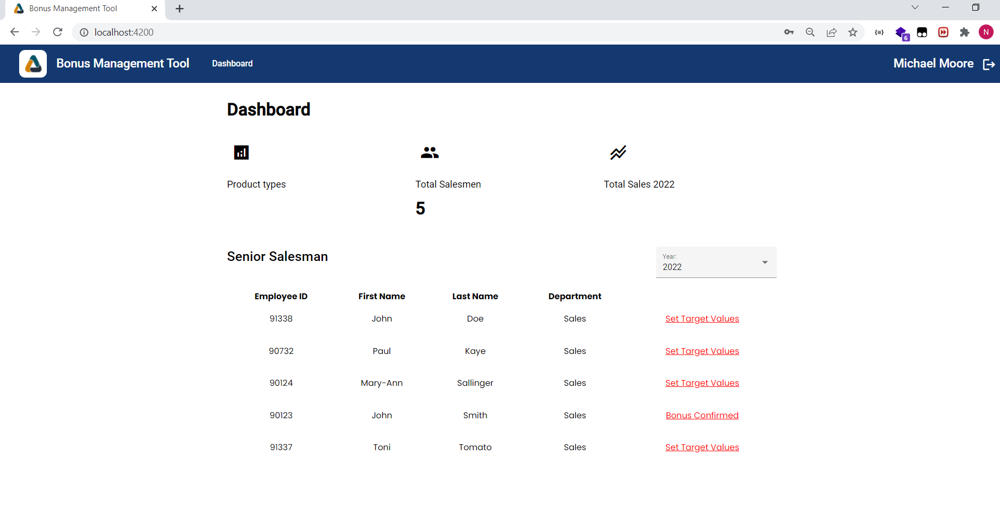
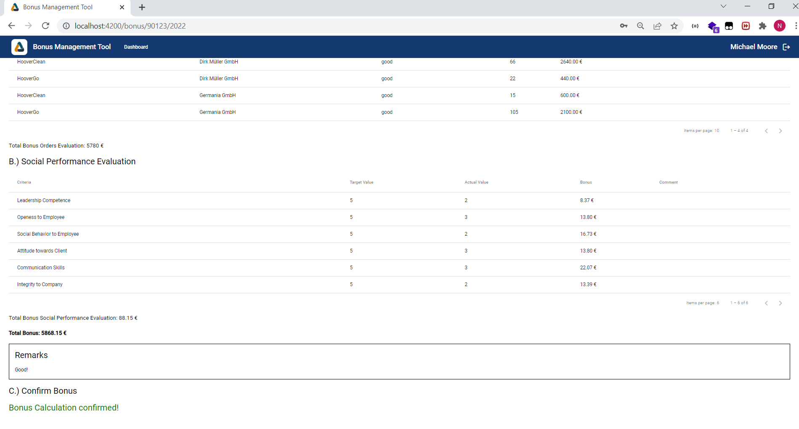
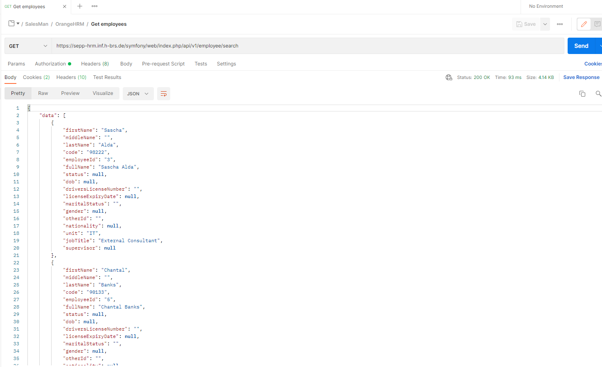
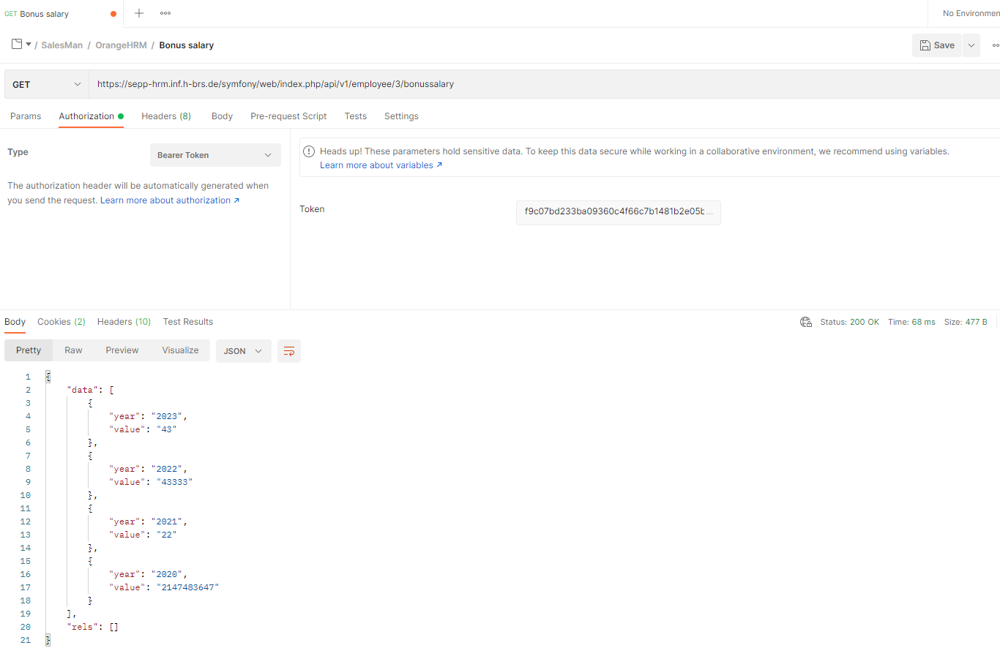
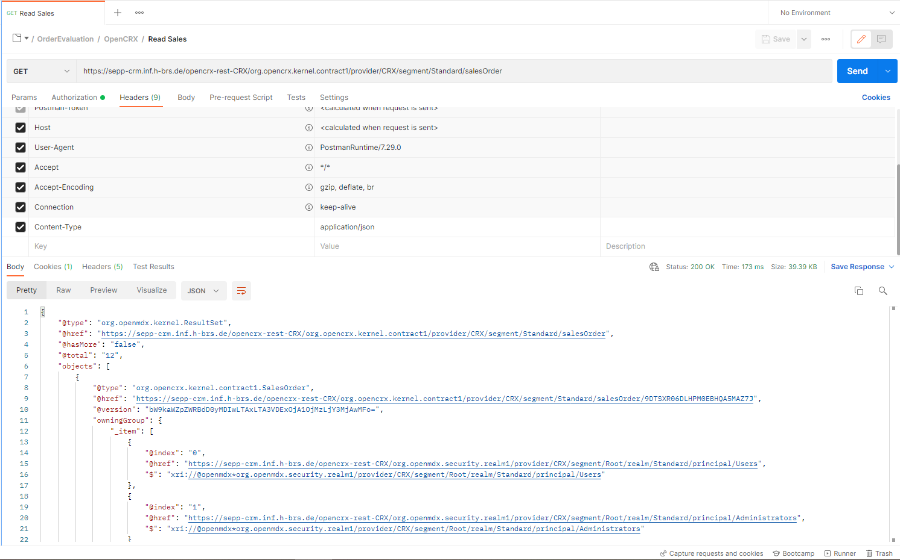
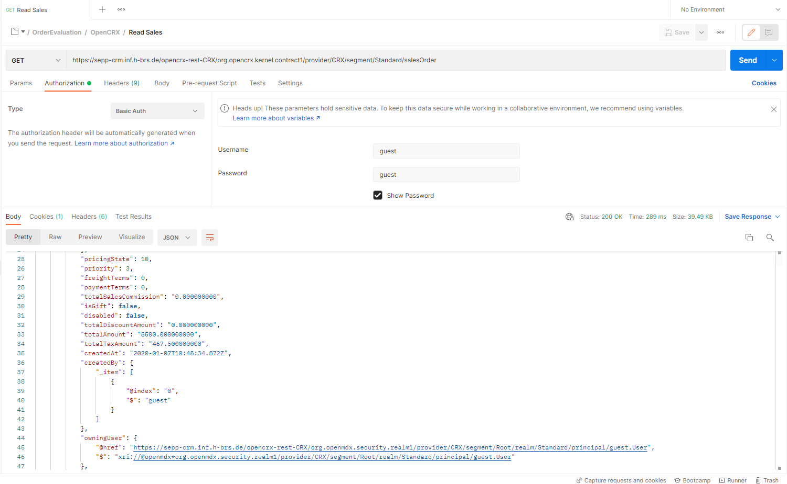

# *Integration Architectures* MEAN Final Results

This template is meant to support students getting started with the Integration Architectures project.

## Final GUI

## Enterprise Applications OrangeHRM & OpenCRX data
The data above coming from OrangeHRM & OpenCRX servers on the Internet are managed and processed within the MEAN applications.
Suitable authentication mechanisms are applied and integrated accordingly.

 1. **OrangeHRM data**

    
    
    

 2. **OpenCRX data**

    
    

## Launching the Applications

For both front- and backend there ar run scripts included in their `package.json`.
So you can just start them by running `npm run start` in their respective directories.

After they are done starting, the frontend can be reached from your browser at: http://localhost:4200/

You can log in with username *admin* and the password, which is printed out to the console output of the backend.
 **!!! Attention: The password will only be printed out on first startup (e.g. when no user is present in the database). So please write it down!**
In case you forgot that, you can still empty the collection 'user' in the database and restart the backend.

It is possible in IntelliJ or WebStorm, to store these start commands in a convenient way and start your applications at a push of a button.
To do so, select "Add Configuration..." at the upper right of your IntelliJ Window. A window will open, which looks like this:

In that window, you click the plus in the upper left corner and then select "npm" from the dropdown menu. This creates a new run configuration.
On the right of the window, you can give your run configuration a name, like "frontend". Also, you have to select the `package.json`. In this example, the one of the frontend.
Make sure "run" is selected as the command and "start" is selected as the script.
After that, you can save your run configuration and try it out.
These steps have to be repeated for the backend. In this case, obviously selecting the `package.json` of the backend.

### Result

If your Login was successful, you will see this page:

