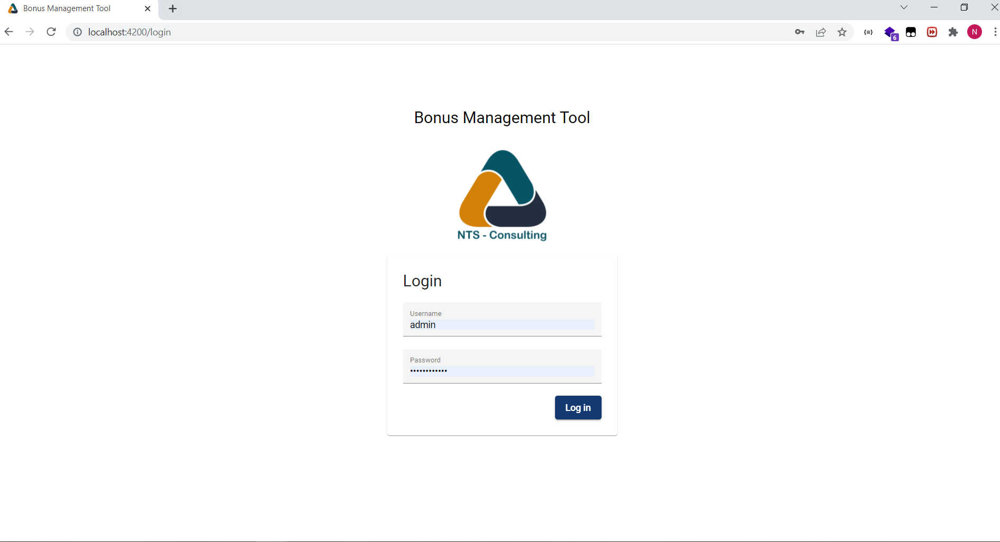
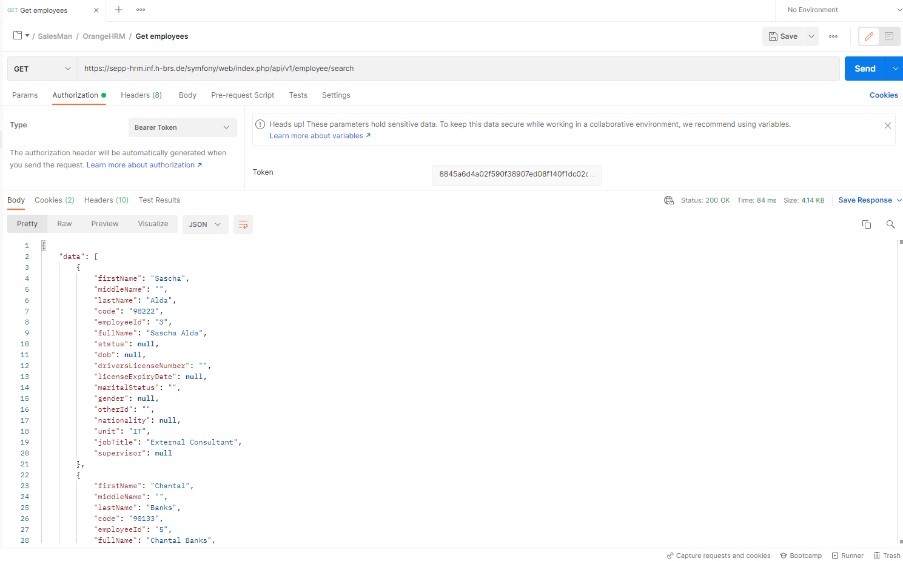
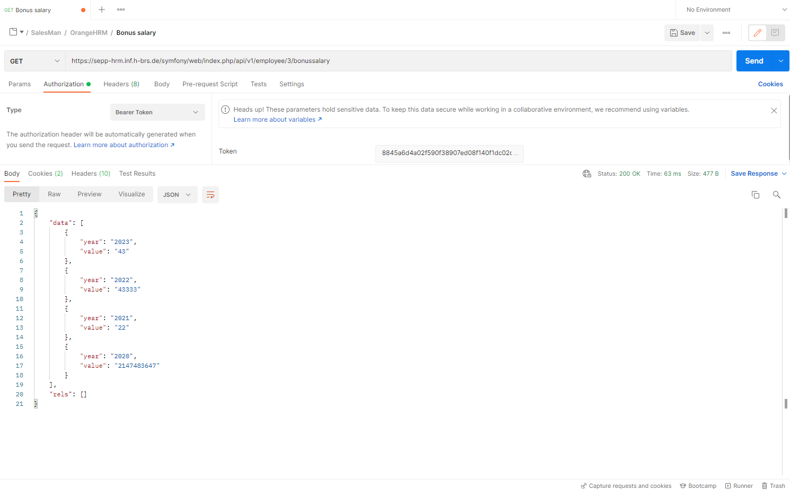
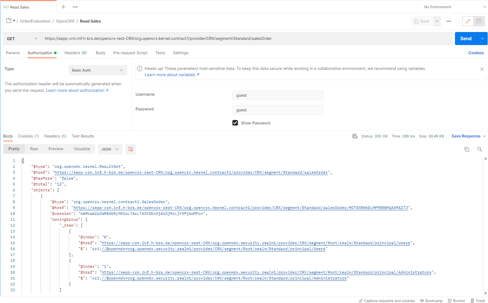
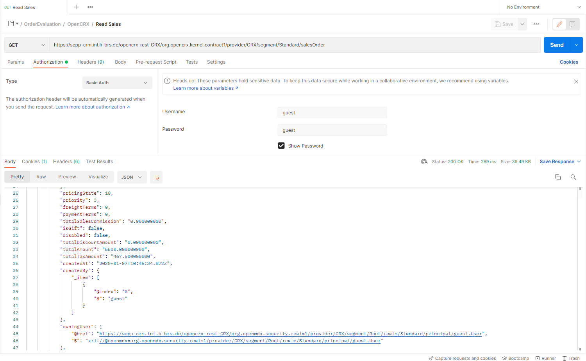

# *Integration Architectures* MEAN Final Results

## Final GUI

## Enterprise Applications OrangeHRM & OpenCRX data
The data above coming from OrangeHRM & OpenCRX servers on the Internet are managed and processed within the MEAN applications.
Suitable authentication mechanisms are applied and integrated accordingly.

1. **OrangeHRM data**

 2. **OpenCRX data**

    

    
 